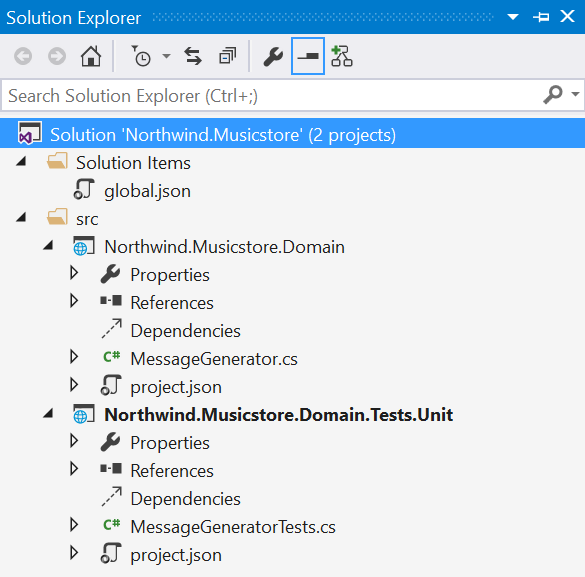

<properties
   pageTitle="Getting Started with XUnit"
   description="Introduction to writing simple tests with XUnit"
   services="service-name"
   documentationCenter="dev-center-name"
   authors="adamstephensen"
   manager="adamstephensen"
   editor=""/>

# Getting started with XUnit

In this demonstration we will 

- Create a class library project
- Create a test project
- Write some simple tests
- Run tests from the command line
- Run tests from inside Visual Studio

## Version Compatibility

Note: Specific versions of xUnit.net only support specific versions of DNX. The examples shown here are done with xUnit.net 2.1 RC 1, xUnit.net DNX runner 2.1 beta 5, and DNX 1.0 beta 7. The version compatibility list is:

TODO: Add image

## Create two class library projects

Figure: Your solution should now resemble the above

## Create a test project

Figure: Add a project for northwind.musicstore.tests.unit

TODO: Add image
Figure: Update project.json in the test project 

## Add the message generator domain class

Add the code below to provide a method that can calculate a greeting

    namespace northwind.musicstore.domain
    {
        public class MessageGenerator
        {
            public string Greet(string target)
            {
                return $"Hello {target}";
    
            }
        }
    }

## Write some simple tests

## Run tests from the command line

## Run tests from inside Visual Studio
